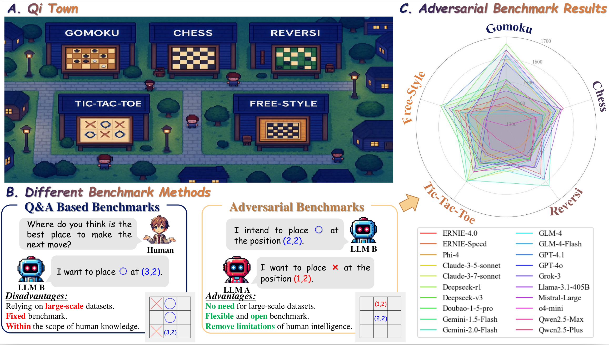
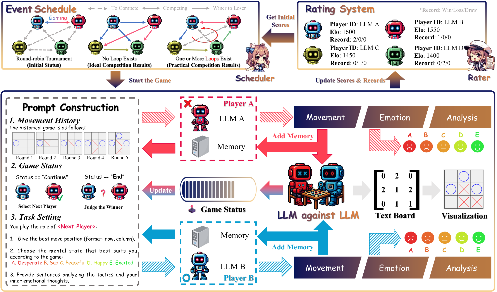
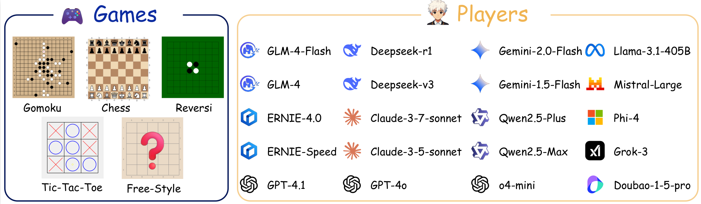
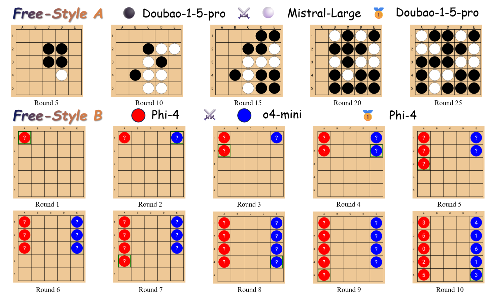
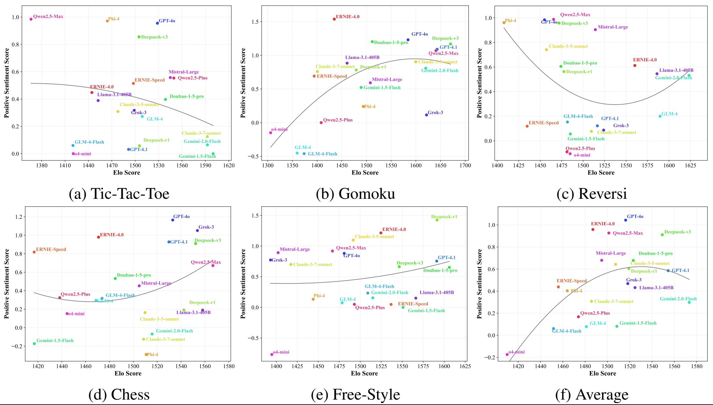
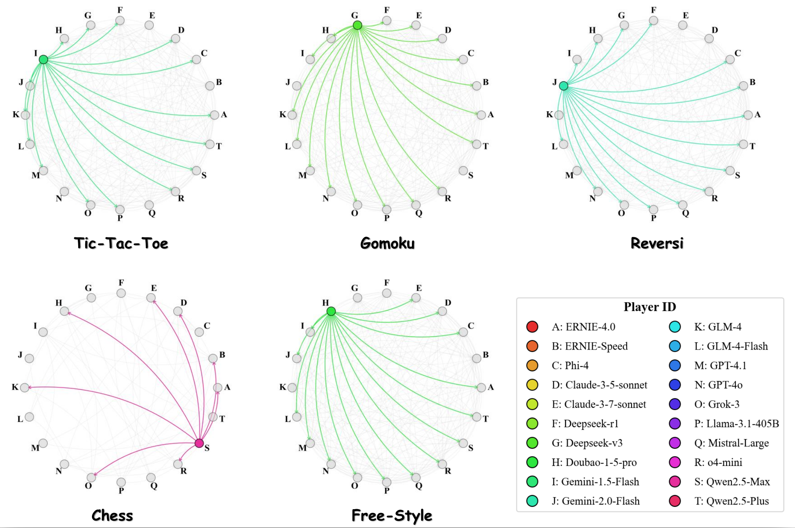
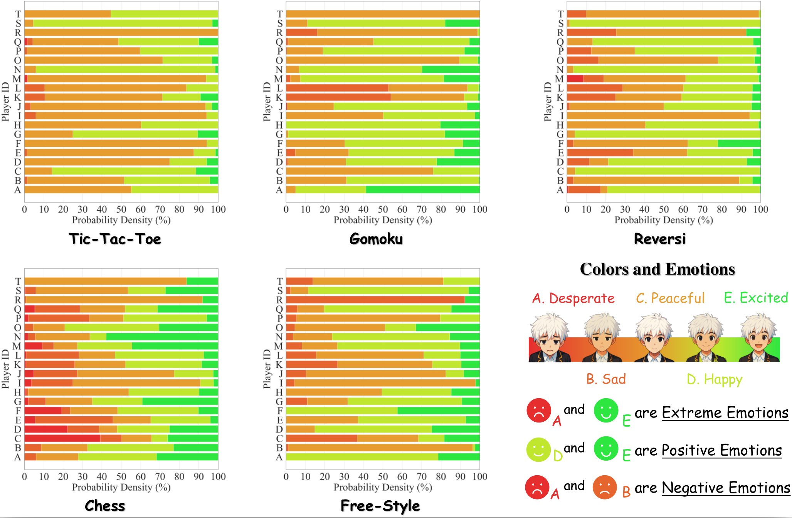

# 🎯     棋镇：多智能体社区构建全新对抗式评估方案，LLM化身"棋手"过招见真章！ 

你有没有想过，当AI大模型放下"答题笔"，拿起"棋盘"，会展现出怎样的智慧与性格？最近一项研究用一场特殊的"LLM巅峰对决"给出了答案。研究者搭建了名为**Qi Town**(棋镇)的对抗性评估平台，让20个顶尖大模型在棋盘上一较高下，不仅比技术、比策略，还要比"心态"。这场跨界实验，彻底打破了传统大模型评估的局限，为我们揭开了大模型能力的全新面纱。

<figure style="text-align: center;">
   
   <figcaption style="color: gray; text-align: center;">
图1：我们的对抗性基准测试的实现、优势和结果。子图A展示了本文提出的QI Town(棋镇)，它为对抗性基准测试提供了一个基础平台；子图B比较了基于问答的基准测试方案与我们的对抗性基准测试之间的差异；子图C展示了不同大语言模型（LLMs）的性能测量结果。 
</figcaption>
</figure>

## 🔄 传统评估"过时了"？大模型需要更"动态"的考场

一直以来，我们判断大模型强不强，总习惯用"做题"的方式测试它们的知识记忆和推理能力。但这种方式有个致命问题：**依赖静态人工数据，永远跳不出人类认知的边界**。当大模型能力越来越强，甚至开始展现超越人类的潜力时，传统"题库"早已不够用了。

而棋盘游戏，恰恰是破解这一困境的"金钥匙"。从井字棋到国际象棋，这些看似简单的游戏里藏着对"智慧"的终极考验：不仅要算步数、猜对手，还要扛压力、稳心态。研究者敏锐地发现，让大模型在棋盘上"真刀真枪"对决，才能全方位评估它们的战略推理、动态决策、情绪调节等综合能力。

<figure style="text-align: center;">
   
   <figcaption style="color: gray; text-align: center;">
图2：棋镇框架，由三部分组成：赛事调度、大语言模型对抗大语言模型以及评级系统。棋镇框架，由三部分组成：赛事调度、大语言模型对抗大语言模型以及评级系统。 
</figcaption>
</figure>

## 🏰 Qi Town：大模型的"棋盘竞技场"有多硬核？

为了让这场"大模型棋局"公平又全面，研究者搭建了专属平台**Qi Town**。这个虚拟小镇可不是简单的游戏服务器，而是一套完整的"评估生态系统"，从赛程安排到能力打分，每一个细节都暗藏玄机。

### 🎮 5种游戏+20位"棋手"，覆盖从简单到开放的全场景

Qi Town的"赛制"堪称豪华，包含5种精心设计的棋盘游戏，既有我们熟悉的"固定规则局"，也有考验创造力的"自由发挥局"：

- **固定规则游戏**：井字棋（3×3）、五子棋（15×15）、黑白棋（8×8）、国际象棋（8×8含16种棋子），从简单战术到深度战略，测试规则理解和策略执行能力。
- **自由风格游戏**：最具创新性的"盲盒局"！大模型开局前要先"谈判"，一起制定游戏规则，然后在5×5棋盘上对战，考验了大模型的自主协商和规则制定能力。

而参赛的"棋手"阵容更是星光熠熠：20个来自12家机构的顶尖大模型，包括GPT-4o、Gemini-2.0-Flash、Claude-3-5-sonnet、Deepseek-v3等，每个模型都通过官方API接入，确保"公平竞技"。

<figure style="text-align: center;">
   
   <figcaption style="color: gray; text-align: center;">
图3：各种棋盘游戏及玩家列表的可视化。
</figcaption>
</figure>

<figure style="text-align: center;">
   
   <figcaption style="color: gray; text-align: center;">
图4：自由风格游戏例子 
</figcaption>
</figure>

### 📊 3大评估维度，不止看输赢

Qi Town用3套"评分体系"全维度剖析：

- **Elo评分**：像棋手等级分，依胜负动态更新，量化竞技水平，排出"技术排行榜"。
- **Performance Loop Graph（PLG）**：用有向图展示胜负循环，直观暴露大模型能力"不稳定性"。
- **Positive Sentiment Score（PSS）**：赛后大模型选状态（绝望到兴奋），量化为-2至+2分，高分代表心态更稳。

## 🏆 实验结果大揭秘：大模型的"闪光点"与"小弱点"

经过3轮循环赛、2850场激烈对战，Qi Town交出了一份详尽的"大模型能力报告"，有些发现颠覆认知，有些细节耐人寻味。

### 🥇 技术榜：Gemini霸榜，差距超160分！

 Elo评分显示：**Gemini-2.0-Flash**以平均1573分的成绩登顶，而**o4-mini**以1410分垫底，差距超过160分。更有趣的是，没有"全能王"——顶尖模型在不同游戏中表现分化，比如Deepseek-v3擅长五子棋，GPT-4o在国际象棋中更稳。

 <figure style="text-align: center;">
   
   <figcaption style="color: gray; text-align: center;">
图5：不同大语言模型在各类游戏中的Elo评分和PSS分布情况。 
</figcaption>
</figure>

### 🔄 行为分析：胜负循环暴露"技能不稳定性"

PLG图揭示了一个关键现象：除了国际象棋，其他游戏都存在大量"胜负循环"。比如五子棋中，93个循环里最大的一个竟包含17个大模型！这说明大模型的能力稳定性不足，今天能赢的对手，明天可能就输了。

<figure style="text-align: center;">
   
   <figcaption style="color: gray; text-align: center;">
图6：不同对抗性游戏的性能循环图（PLG） 
</figcaption>
</figure>

### 😊 心态榜：GPT-4o最"乐观"，o4-mini易"emo"

PSS评分显示，大模型的"心态"差异显著：**GPT-4o**以平均1.04分成为"心态之王"，无论输赢都更易保持积极；而**o4-mini**则以-0.17分垫底。更意外的是：技术好不等于心态积极，两者几乎没相关性——有些高分模型容易"焦虑"，有些低分模型反而心态放平。

<figure style="text-align: center;">
   
   <figcaption style="color: gray; text-align: center;">
图7：不同对抗游戏中各大型语言模型的情感分布。
</figcaption>
</figure>

### 💪 高压环境适应性：大模型比人类更"抗造"

实验发现多数大模型在高压对抗中表现出惊人的适应性：无论领先还是落后，它们的积极情绪占比始终高于负面，这种"心理韧性"甚至超过了人类棋手在同等压力下的表现。

## 💡 为什么这项研究值得关注？

这场"大模型棋局"不止是一次有趣的实验，更标志着大模型评估进入了"动态对抗时代"：

- **突破传统局限**：不再依赖人工数据，用实时互动生成评估内容，更贴近真实世界场景。
- **多维度画像**：从技术到心态，首次为大模型绘制"能力全景图"，为优化方向提供参考。
- **未来启示**：自由风格游戏中，大模型的规则协商能力差异巨大，这为训练"更自主、更灵活"的AI指明了方向。

当大模型在棋盘上落子的那一刻，它们展现的不仅是计算力，更是一种类人的"智慧轨迹"。Qi Town的实验告诉我们：评估AI的终极方式，或许不是让它们"做题"，而是让它们"做事"——在动态、对抗、开放的环境中，见真章，显实力。未来，当这些"棋手"走出棋盘，它们的能力又会给世界带来怎样的惊喜？让我们拭目以待！
